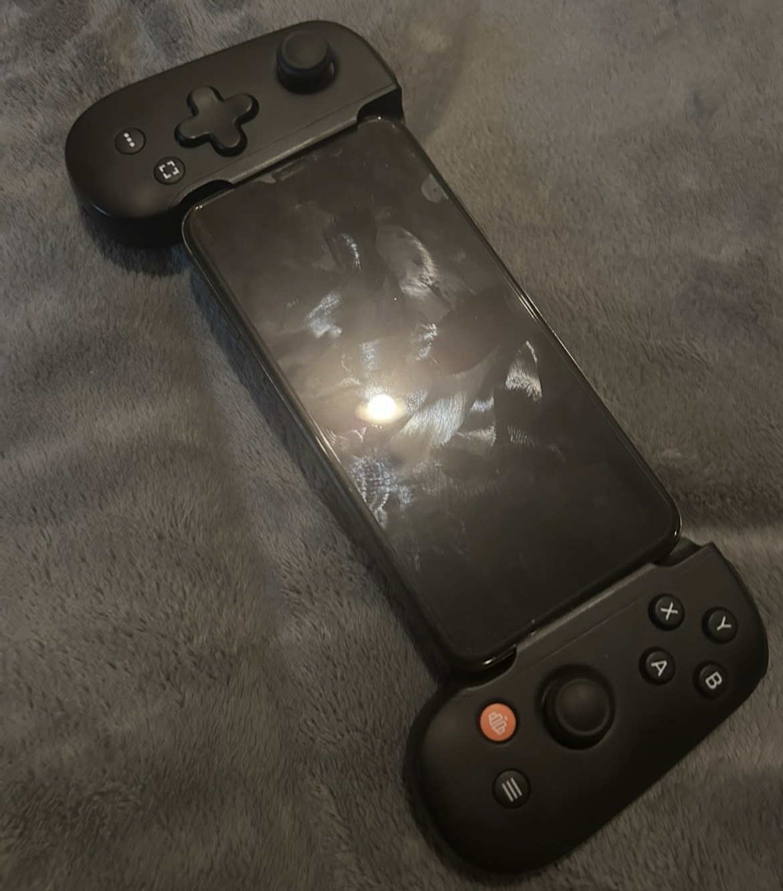
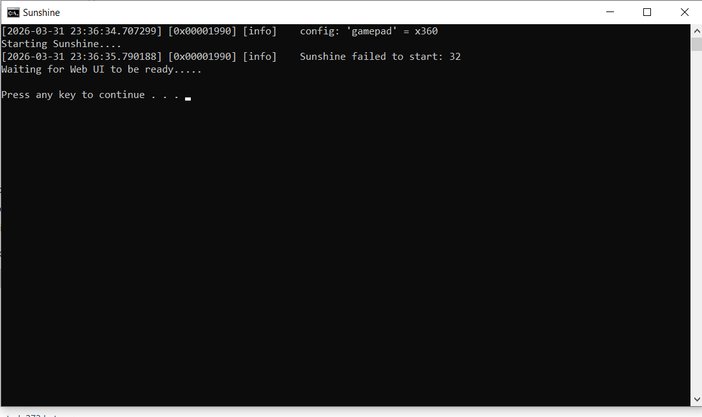
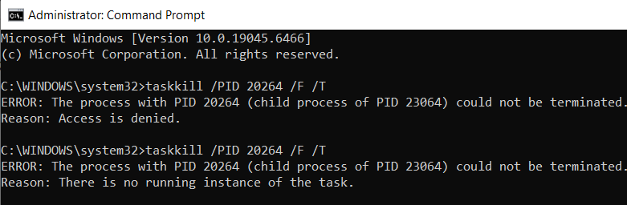
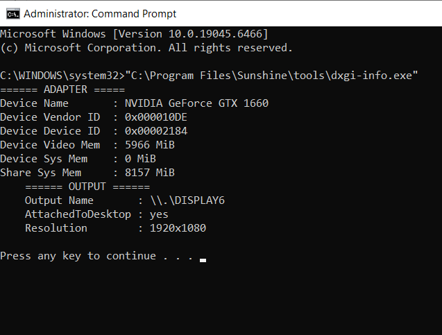
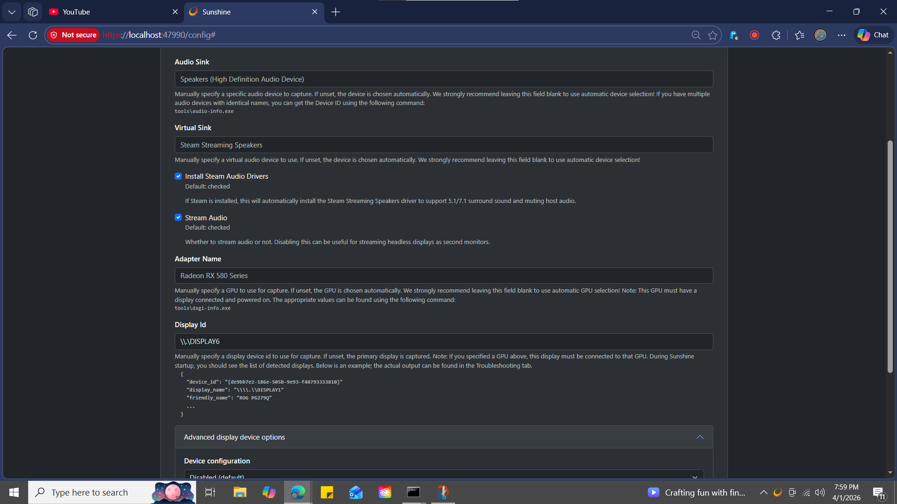
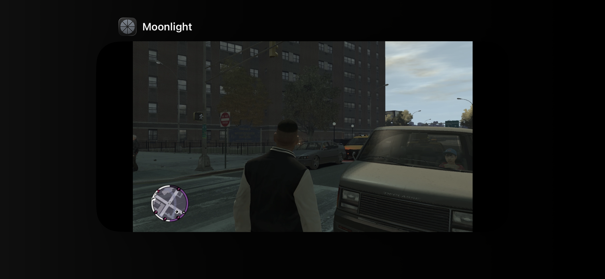

# Local Game Streaming w/ Sunshine and Moonlight

I have a Backbone controller which is this gamepad thing that wraps around your iPhone and turns it into something like a steam deck. I wanted to see if stream games from my PC to my phone so I could play anywhere in my house without being chained to my desk. I was initially going to use Nvidia Game Stream but they have since discontinued the software.
I installed *Sunshine* on my PC the thing that broadcasts, install *Moonlight* on my iPhone the software that receives the broadcast, to pair them up, and play. I thought it was going to be a lot simpler than it was.

---

## What Actually Happened
I downloaded Sunshine, ran the installer, it finished clean. Desktop icon appeared. I double clicked it like any normal program. A terminal window opened and printed this:

Error 32. No explanation, no suggestion, just a number; you're welcome for the helping hand, right? 

Turns out "error 32" is a Windows system code meaning that the port already in use, but nothing on screen told me that. I had to Google it. This is where I hit my first big UX problem: the **error messaging** was useless. Good error messages explain what happened, why, and what to do next. "Failed to start: 32" does none of that. They could have elaborated a little extra further at no extra cost.

The actual cause was that Sunshine installs itself as a background Windows service that starts automatically, but I had also manually launched the .exe on top of it. Two copies of the same program were fighting over the same port. The thing is, nothing told me not to launch it manually or told me that it did launch or helped me on board. The installer left a desktop icon sitting there, and I thought that icons were meant to be clicked.

I think this is an **affordance** failure.

> An object should communicate how they should be used through their design. A door handle affords pulling. A desktop icon affords a double click. When an affordance leads you to do the wrong thing, that's on the design not on me the user. If it's gonna silently run in the background it could at least like quickly show me a tutorial or something, or send a lowkey system notification to let me know hey it's working. 

I spent like 15 minutes trying to kill the broken process through Task Manager and Command Prompt. Even running as full Administrator it refused to die:

It both existed and didn't exist at the same time, I just power cycled my PC at this point. I was annoyed. 

Then just as I think everything is working, after getting Sunshine running properly, I connected Moonlight on my phone and then the stream just hung. Connected but showing nothing, stuck on "Starting Desktop" forever. The fix turned out to be that my monitor was registered as `\\.\DISPLAY6` in Windows instead of the normal `DISPLAY1`, and Sunshine was looking in the wrong place. 

How would I have possibly known that? Nothing in Sunshine's interface hinted this was the problem. If the fix requires knowing how to run a command line tool, copying a cryptic display name, and pasting it into a config field manually. This completely broke any sort of **discoverability**.

> Good discoverability should ensure that user can figure out what to do just by looking at the interface without needing outside help. If I wanna just quickly hop on and get these games going this kind of stuff really impedes a new user from getting it done. If the only way to find critical information is a hidden CLI tool, discoverability has failed. 

After all of this, I had to manually open firewall ports via Command Prompt, switch the encoder to NVENC for my Nvidia GPU, and restart the service using `net stop/start SunshineService` because the tray icon restart kept breaking and I would instinctively go to click the icon triggering the same zombie process bug.

It finally worked.

---

The root cause of most of these issues was a mismatch between my **mental model** and how Sunshine actually works. A **mental model** is the what a user builds in their head about how a system works, based on their past user experiences

My mental model went something like : install program → it runs → connect phone → done. That's how you hope every piece of commercial software works, plug and play.

Sunshine's actual model: install → service auto-starts in background → never touch the exe → configure through a local web browser → connect phone. None of that is communicated during setup. The gap between what I expected and what was real caused probably 80% of the problems. 

---

## How It Could Be Better

Sunshine is a free, open-source project, not a commercial product. The fact that it exists and works as well as it does when configured correctly is pretty impressive, especially when all my roommates are asleep and not on the Wi-Fi. Streaming quality was smooth with low latency.

But the setup experience assumes you're already comfortable with Windows services, firewall rules, CLI and display driver stuff. For a lot of people thats a wall.

---

Potential improvements :

**1. Remove or disable the desktop shortcut.** If launching the exe breaks the service, the icon shouldn't be there. Or clicking it should just open the web dashboard.

**2. Auto detect the display on first launch.** If the monitor is DISPLAY6, Sunshine should find it and set the config automatically not just silently fail. All of this stuff is accessible programmatically it shouldn't be an issue to automate this.

**3. Translate error codes into plain language.** "Failed to start: 32" should say "Another instance is already running click here to fix it." Something, anything other than leaving me to look it up.

**4. A setup wizard on first run.** Walk users through firewall rules, display detection, and encoder selection. Most of the manual CMD work I did could be a step by step guided setup.

Sunshine is very good for what it is.

---

*UX J01 · March 2026*
